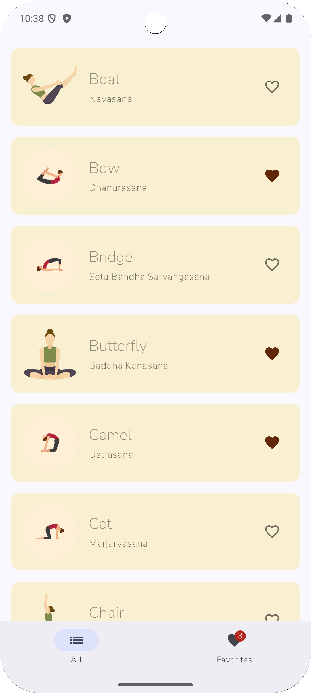
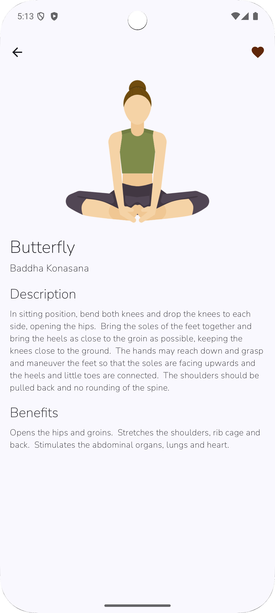

# 📱 Covenal - Android Technical Challenge

**Android Frontend Developer Take-Home Challenge**

This is a simple Android wellness app built for the *Android Frontend Developer* position. The app displays a list of wellness sessions (yoga poses), allows users to view details, and mark their favorites.

---

## 📸 Screenshots

|                  List Screen (Light Vibrant Theme)                  |                              Detail Screen                              |
|:-------------------------------------------------------------------:|:-----------------------------------------------------------------------:|
|  |  |
---

## 🎯 Features

* **List Screen:** Displays a scrollable list of yoga poses.
* **Detail Screen:** Tapping a pose navigates to a detail screen with more information.
* **Persistent Favorites:** Users can add/remove poses from a favorites list. The state is saved locally using a **Room database**, so favorites are remembered even after the app closes.
* **Themed UI:**
    * Uses a custom "Light Vibrant" color palette (`AppCardColors.kt`) for all list items.
    * Uses the custom `NunitoSans` variable font for all text.
* **Robust Data Strategy:** The app uses a **remote-first, local-fallback** approach.
    * It first tries to fetch data from the live API.
    * If the network fails (timeout or offline), it shows a user-friendly Toast message and seamlessly loads the data from a local `poses.json` file.
* **Polished Error States:** A custom "Something snapped!" screen (`ErrorStateView`) is shown if the local data file fails to load.

---

## ⚙️ Technical Stack & Architectural Decisions

This project was built using **100% Kotlin** and follows modern Android development practices.

| Component | Technology | Rationale |
| :--- | :--- | :--- |
| **Architecture** | **MVVM + Clean Architecture** | The app uses a modern MVVM pattern. It is further decoupled by a **Domain Layer** (Use Cases) that separates business logic from the ViewModels and Repositories. This ensures a clean separation of concerns and high testability. |
| **UI** | **Jetpack Compose** | The modern, declarative UI toolkit for Android. Allows for building UI faster and with less boilerplate code. |
| **Asynchronicity** | **Kotlin Coroutines & Flow** | Used for all asynchronous operations, from network calls (`suspend`) to managing live data streams (`StateFlow`) for favorites and UI state. |
| **Dependency Injection** | **Hilt** | Manages the creation and injection of all dependencies (e.g., providing Repositories to UseCases, and UseCases to ViewModels). |
| **Unit Testing** | **JUnit 4, MockK, Coroutines Test** | Unit tests were written for the `SessionListViewModel` to verify its UI state logic. `MockK` is used to mock repositories, and a custom `MainDispatcherRule` manages coroutine dispatchers. |
| **Navigation** | **Jetpack Navigation (Compose)** | A type-safe, single-source-of-truth (`Screen.kt`) approach to managing navigation between composables. |
| **Networking** | **Retrofit & OkHttp** | The industry standard for type-safe REST API calls. An OkHttp interceptor is used to log network traffic, and timeouts are set to 30 seconds to handle the "spin-up" time of the free API. |
| **Data Parsing** | **Moshi** | A modern, efficient JSON parser that works well with Kotlin data classes. |
| **Data Source** | **Hybrid (Remote/Local)** | The `SessionRepository` acts as the single source of truth for *poses*, first attempting a network call. On failure, it falls back to a bundled `poses.json` file. |
| **Persistence** | **Room Database** | User favorites are persisted locally in a Room database. The `FavoritesRepository` abstracts this logic from the UseCases. |
| **Build** | **KSP (Kotlin Symbol Processing)** | Replaced `kapt` for both Hilt and Room to significantly improve build speed and performance. |
| **Image Loading** | **Coil** | A modern, Kotlin-first image loading library that integrates perfectly with Jetpack Compose. |
| **Theming** | **Static Theme** | A custom, consistent color palette (`lightVibrant`) is defined in `AppPalettes.kt` and applied to all cards via `AppCardColors.kt` for a clean, branded feel. |
| **Font** | **`NunitoSans` (Variable Font)** | A custom variable font (`.ttf`) is bundled in `res/font` and defined in `Type.kt` to give the app a unique, serene feel. |

---

## 🚀 How to Build and Run

1.  Clone this repository:
    ```bash
    git clone https://github.com/aghmnl/covenal-wellness-challenge
    ```
2.  Open the project in a recent version of Android Studio (e.g., Iguana or newer).
3.  Let Gradle sync all dependencies.
4.  Build and run the app on an emulator or physical device.

---

## 🧪 How to Test

### Unit Tests
The unit tests for the `SessionListViewModel` are located in `app/src/test/java/com/agus/wellnessapp/ui/list/`.

You can run them by:
1.  Right-clicking the `SessionListViewModelTest.kt` file.
2.  Selecting "Run 'SessionListViewModelTest'".

### Offline Mode
1.  Ensure the app is fully closed.
2.  Turn on **Airplane Mode** on your device or emulator.
3.  Open the app.
4.  Observe the **"Could not reach server. Loading local data."** Toast message.
5.  The app will load the list instantly from the local `poses.json` file.